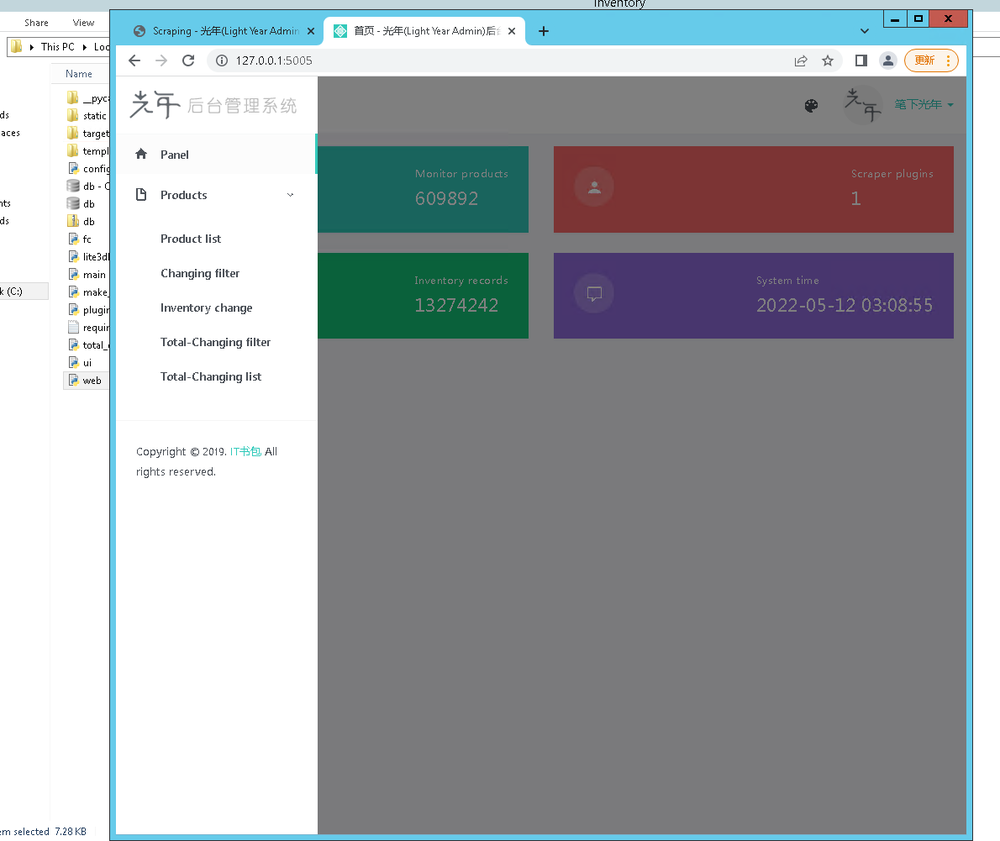
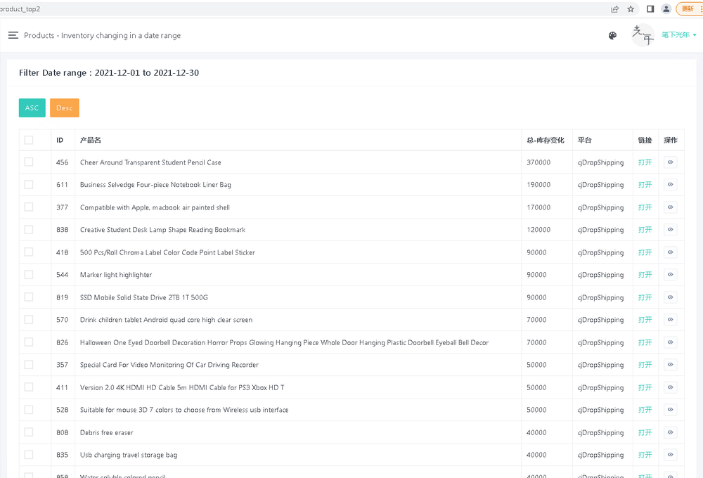
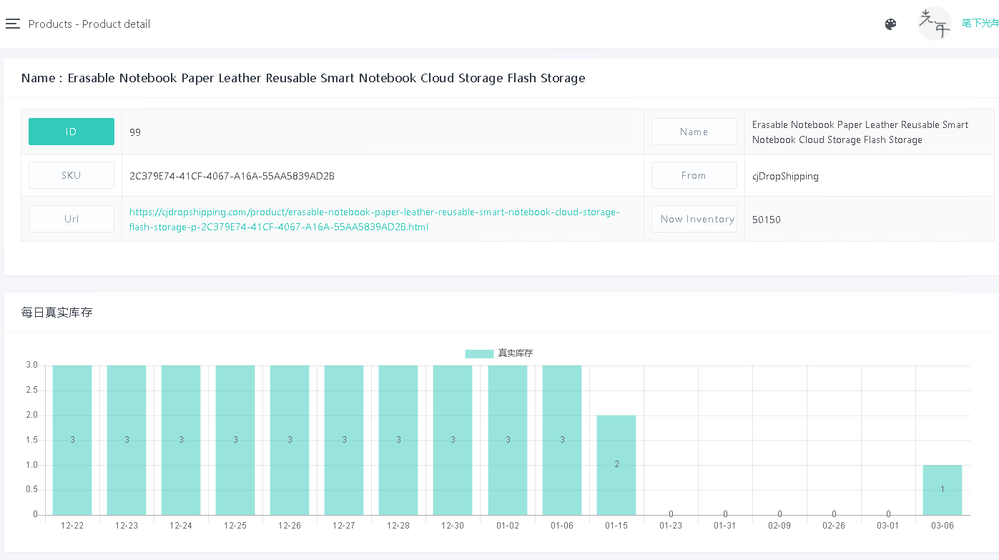
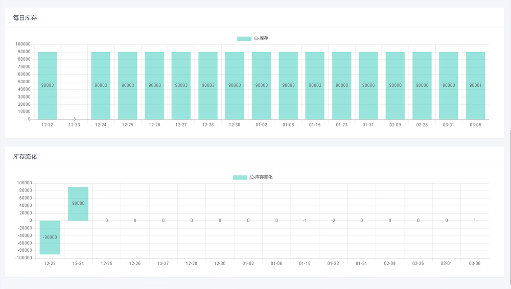

## Inventory monitor system
Inventory web scraper, Scrape inventory information from an e-commerce website, Data mining and Data analysis.
It has webAdmin centre, so you can check the data chart online, and get more valuable information form it.

There are 500K products on Cjdropshipping, The scraping part scrapes the product's data from the API of Cjdropshipping, it keeps the inventory for a product every day, then the webAdmin part could do the math to show him the Bar Graph. It filters out the most popular goods and tells how popular it is.

